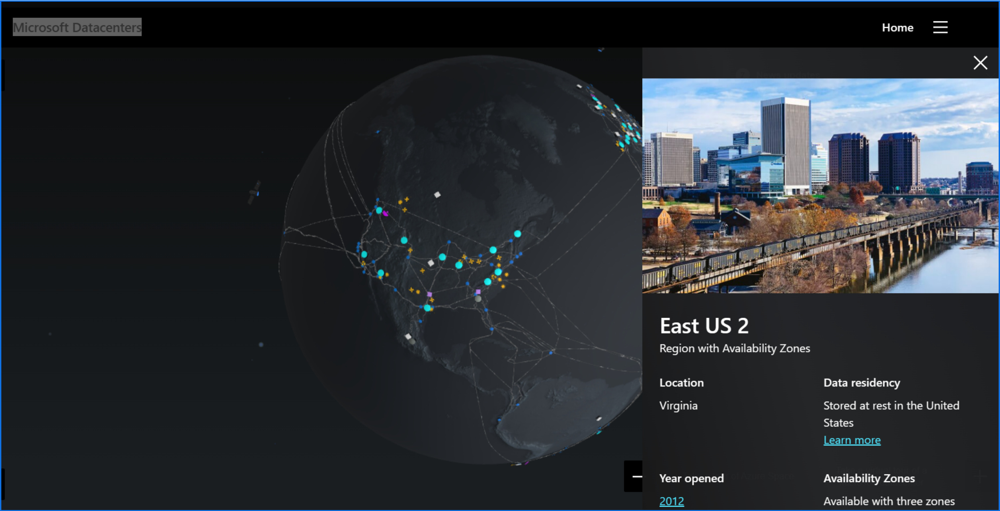

# Region

Una región en Azure es una zona geográfica que contiene al menos un centro de datos, aunque puede contener varios. Estas regiones permiten a los usuarios seleccionar la ubicación física de sus datos y servicios para cumplir con las regulaciones, minimizar la latencia o mejorar la resiliencia y disponibilidad. Algunas regiones también ofrecen "zonas de disponibilidad", que son centros de datos separados físicamente dentro de la misma región, para proporcionar mayor protección contra fallas.

**Tools**

**[Azure Latency Test](https://www.azurespeed.com/Azure/Latency):** es una herramienta para medir la latencia de red entre una ubicación y las regiones de Azure. Es importante para los arquitectos al dimensionar un escenario para un cliente porque ayuda a optimizar el rendimiento de la aplicación, mejora la experiencia del usuario y puede ayudar a cumplir con los requisitos de los acuerdos de nivel de servicio (SLA). La elección de la región de Azure con la menor latencia puede resultar en una aplicación más rápida y receptiva.

**[Microsoft Datacenters](https://datacenters.microsoft.com/globe/explore):** En este sitio se pueden visualizar todos los datacenter de Azure.

